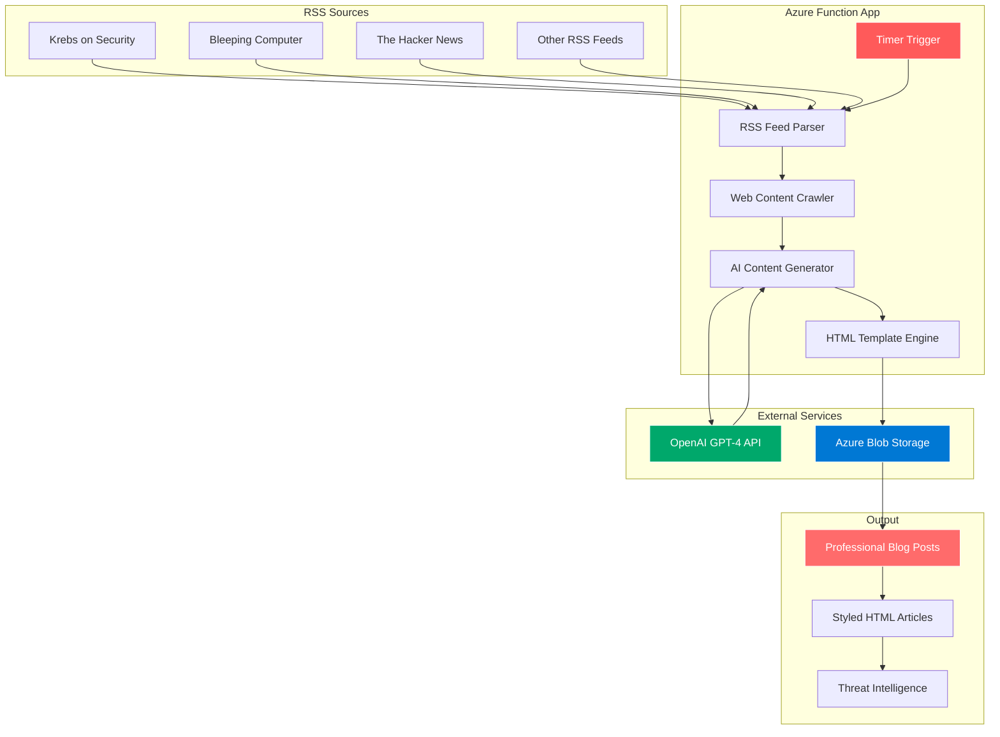
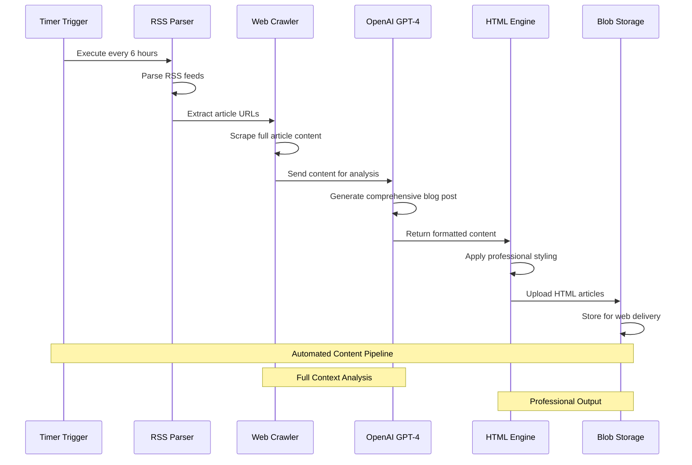
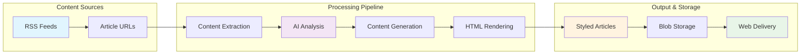

# Blog Post Creator

🔐 **AI-Powered security Blog Generation System**

An intelligent Azure Function that automatically generates professional security blog posts by crawling RSS feeds, extracting full article content, and using AI to create comprehensive, technically accurate analysis articles.

[](https://opensource.org/licenses/MIT)
[](https://azure.microsoft.com/en-us/services/functions/)
[](https://www.python.org/downloads/)
[](https://openai.com/)

## 🏗️ Architecture Overview



## 🔄 Data Flow Architecture



## ⚡ Key Features

- 🤖 **AI-Powered Analysis**: Uses GPT-4 to generate comprehensive security analysis
- 🌐 **Smart Web Crawling**: Extracts full article content from RSS feed links
- 🎨 **Professional Styling**: Dark theme with red accents, mobile responsive
- 📊 **Threat Assessment**: Automatically categorizes threat levels (Critical/High/Medium/Low)
- 🏷️ **Keyword Extraction**: Identifies relevant security terms and topics
- ☁️ **Azure Integration**: Seamless deployment with Azure Functions and Blob Storage
- 🔧 **Configurable Sources**: Easy to add/remove RSS feeds and customize behavior
- 📱 **Mobile Optimized**: Responsive design that works on all devices

## 🚀 Quick Start

### Prerequisites

- Azure Account with Function App
- OpenAI API Key
- Python 3.8+
- Azure CLI (for deployment)

### 1. Clone Repository

```bash
git clone https://github.com/your-username/blog-creator.git
cd blog-creator
```

### 2. Configure Environment

Create a `local.settings.json` file:

```json
{
  "IsEncrypted": false,
  "Values": {
    "AzureWebJobsStorage": "your_azure_storage_connection_string",
    "FUNCTIONS_WORKER_RUNTIME": "python",
    "OPENAI_API_KEY": "your_openai_api_key_here",
    "RSS_FEEDS": "https://krebsonsecurity.com/feed/,https://www.bleepingcomputer.com/feed/,https://feeds.feedburner.com/TheHackersNews",
    "CONTENT_MAX_LENGTH": "12000",
    "ARTICLES_PER_FEED": "3",
    "LOG_LEVEL": "INFO",
    "STORAGE_CONTAINER_NAME": "articles"
  }
}
```

### 3. Deploy to Azure

Using Azure CLI:

```bash
# Login to Azure
az login

# Create resource group
az group create --name -rg --location "West Europe"

# Create storage account
az storage account create \
  --name storage \
  --resource-group -rg \
  --location "West Europe" \
  --sku Standard_LRS

# Create function app
az functionapp create \
  --resource-group -rg \
  --consumption-plan-location "West Europe" \
  --runtime python \
  --runtime-version 3.8 \
  --functions-version 4 \
  --name -functions \
  --storage-account storage

# Deploy function
func azure functionapp publish -functions
```

### 4. Configure Application Settings

```bash
az functionapp config appsettings set \
  --name -functions \
  --resource-group -rg \
  --settings \
  "OPENAI_API_KEY=your_api_key" \
  "RSS_FEEDS=https://krebsonsecurity.com/feed/,https://www.bleepingcomputer.com/feed/"
```

## ⚙️ Configuration Options

### Environment Variables

| Variable | Description | Default | Required |
|----------|-------------|---------|----------|
| `OPENAI_API_KEY` | OpenAI API key for GPT-4 | - | ✅ |
| `AzureWebJobsStorage` | Azure Storage connection | - | ✅ |
| `RSS_FEEDS` | Comma-separated RSS feed URLs | See default config | ✅ |
| `CONTENT_MAX_LENGTH` | Max characters per article | 12000 | ❌ |
| `ARTICLES_PER_FEED` | Articles to process per feed | 3 | ❌ |
| `LOG_LEVEL` | Logging level | INFO | ❌ |
| `STORAGE_CONTAINER_NAME` | Blog storage container | articles | ❌ |

### Default RSS Feed Sources

- **Krebs on Security**: `https://krebsonsecurity.com/feed/`
- **Bleeping Computer**: `https://www.bleepingcomputer.com/feed/`
- **The Hacker News**: `https://feeds.feedburner.com/TheHackersNews`

Add custom feeds by updating the `RSS_FEEDS` environment variable.

## 🎨 System Functions

### GenerateArticles (Timer Function)
- **Trigger**: Timer (configurable schedule)
- **Default**: Every 6 hours
- **Process**: 
  1. Parse RSS feeds
  2. Extract full article content
  3. Generate AI-powered blog posts
  4. Store as styled HTML in blob storage

### GetArticles (HTTP Function)
- **Endpoint**: `/api/GetArticles`
- **Method**: GET
- **Response**: JSON list of all generated articles
- **Format**:
```json
{
  "total": 15,
  "articles": [
    {
      "name": "krebsonsecurity-com-20250910-1430.html",
      "url": "https://storage.blob.core.windows.net/articles/...",
      "created": "2025-09-10 14:30 UTC",
      "size": 4096
    }
  ]
}
```

### ClearArticles (HTTP Function)
- **Endpoint**: `/api/ClearArticles`
- **Method**: POST
- **Authorization**: Requires `Code` header
- **Function**: Removes all articles from storage
- **Response**: Count of deleted articles

## 🛠️ System Components



## 🎨 Customization

### Adding New RSS Sources

Update the `RSS_FEEDS` environment variable:

```bash
RSS_FEEDS="https://krebsonsecurity.com/feed/,https://www.bleepingcomputer.com/feed/,https://your-custom-feed.com/rss"
```

### Styling Theme

Modify CSS variables in the HTML template:

```css
:root {
    --primary-color: #FF5A5A;      /* Main accent color */
    --secondary-color: #FF6B6B;    /* Secondary accent */
    --background-color: #000000;   /* Dark background */
    --text-primary: #FFFFFF;       /* Primary text */
    --text-secondary: #CCCCCC;     /* Secondary text */
}
```

### Content Generation

Blog posts follow this structure:
1. **Opening Hook** - Attention-grabbing statistics/facts
2. **Clear Introduction** - Context and importance
3. **Technical Analysis** - Detailed breakdown with subheadings
4. **Business Implications** - Impact assessment
5. **Security Recommendations** - Actionable advice
6. **Strong Conclusion** - Key takeaways and next steps

## 📊 Monitoring & Logging

The system provides comprehensive logging:

```
🚀  Article Generator started
📡 Processing RSS feed: https://krebsonsecurity.com/feed/
✅ Extracted 8,432 characters using selector: .entry-content
🤖 Generating AI blog post for: Critical Vulnerability Discovered...
✅ Generated 2,847 character blog post
✅ Created blog post: krebsonsecurity-com-20250910-1430.html
```

Monitor these key metrics:
- Articles processed per run
- Content extraction success rate
- AI generation completion rate
- Storage upload success rate

## 🔒 Security Features

- **Defensive Focus**: Only generates defensive security content
- **API Key Security**: Secure environment variable storage
- **Content Validation**: Automatic threat level assessment
- **Source Attribution**: All articles link back to original sources

## 🤝 Contributing

We welcome contributions! To get started:

1. Fork the repository
2. Create a feature branch
3. Make your changes
4. Add tests if applicable
5. Submit a pull request

## 📝 License

This project is licensed under the MIT License - see the [LICENSE](LICENSE) file for details.
